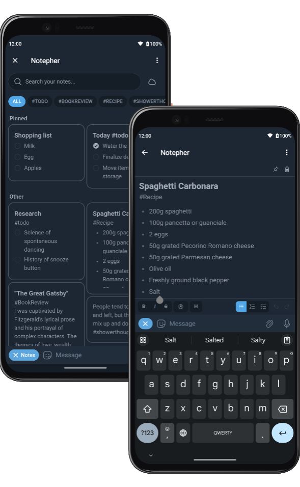

<h1 align="center">
  <a href="https://t.me/NotepherBot">
    <div align="center">
      
    </div>
    <span>
      Notepher Bot
    </span>
  </a>
</h1>



[Notepher](https://t.me/NotepherBot) is an intuitive note-taking [Telegram Mini App](https://core.telegram.org/bots/webapps) designed to effortlessly capture your ideas, to-do lists, and important information. Stay organized and productive without leaving your favorite messenger. 

## Features

- **Offline First**. Notes are stored locally and synchronized when an internet connection is available.
- **Synced**. Notepher leverages the power of [Telegram Cloud Storage](https://core.telegram.org/bots/webapps#cloudstorage) to keep your notes in sync across all your devices.
- **Seamless**. Interface colors match your app theme.
- **Organized**. Tag your notes and filter them by tags, pin the most important notes at the top.
- **Search**. Instantly search through all your notes.
- **Powerful**. Formatting, text highlighting, editing history, lists and to-do lists.

For more details, check out [User Guide](./README_USER.md).

## Launch

Follow these steps to set up and run your bot using this repository:

1. **Clone Repository**

    ```bash
    git clone https://github.com/deptyped/notepher-bot.git
    ```

2. **Build and Deploy Web App**

    After cloning the repository, navigate to the `web-app` directory:

    ```bash
    cd apps/web-app
    ```

    Run the following command to build the web app:
    ```bash
    npm run build
    ```

    This command will generate build output resources inside the `dist` directory. You can now deploy these resources as a regular static website to your hosting provider of choice.

    For information on launching the web app in developer mode, please refer to [apps/web-app/README.md](./apps/web-app/README.md)

3. **Configure the Menu Button**

    - Open the Telegram app and search for "[@BotFather](https://t.me/BotFather)".
    - Start a chat with [@BotFather](https://t.me/BotFather).
    - Use the `/setmenubutton` command to see your bot list and select the bot you want to configure the menu button.
    - Follow the prompts to set up the menu button with the URL obtained in the previous step.
    - After that, the menu button will be available to users when they interact with your bot.

  **Congrats!** Web App is deployed and available to bot users.

> [!NOTE]
> At this stage web app is fully functional, further steps are optional.

4. **Environment Variables Setup**
    
    Once you have completed the web app build and deployment, navigate to the `apps/bot` directory:

    ```bash
    cd ../bot
    ```

    Create an environment variables file by copying the provided example file:
     ```bash
     cp .env.example .env
     ```
    Open the newly created `.env` file and set the `BOT_TOKEN` environment variable. This token should be obtained from [@BotFather](https://t.me/BotFather). 

    Set the `WEB_APP_URL` environment variable with the URL obtained during the web app deployment (step 2).

5. **Launching the Bot**
    
    You can run your bot in both development and production modes.

    **Development Mode:**
    
    Install the required dependencies:
    ```bash
    npm install
    ```
    Start the bot in watch mode (auto-reload when code changes):
    ```bash
    npm run dev
    ```

   **Production Mode:**
    
    Install only production dependencies (no development dependencies):
    ```bash
    npm install --only=prod
    ```
    
    Set the `NODE_ENV` environment variable to "production" in your `.env` file. Also, make sure to update `BOT_WEBHOOK` with the actual URL where your bot will receive updates.
    ```dotenv
    NODE_ENV=production
    BOT_WEBHOOK=<your_webhook_url>
    ```
    
    Start the bot in production mode:
    ```bash
    npm start
    # or
    npm run start:force # if you want to skip type checking
    ```

### List of Available Commands

- `npm run lint` — Lint source code.
- `npm run format` — Format source code.
- `npm run typecheck` — Run type checking.
- `npm run dev` — Start the bot in development mode.
- `npm run start` — Start the bot.
- `npm run start:force` — Start the bot without type checking.

## Environment Variables

<table>
<thead>
  <tr>
    <th>Variable</th>
    <th>Type</th>
    <th>Description</th>
  </tr>
</thead>
<tbody>
  <tr>
    <td>NODE_ENV</td>
    <td>String</td>
    <td>Specifies the application environment. (<code>development</code> or <code>production</code>)</td>
  </tr>
  <tr>
    <td>BOT_TOKEN</td>
    <td>
        String
    </td>
    <td>
        Telegram Bot API token obtained from <a href="https://t.me/BotFather">@BotFather</a>.
    </td>
  </tr>
  <tr>
    <td>WEB_APP_URL</td>
    <td>
        String
    </td>
    <td>
        HTTPS link to Web App.
    </td>
  </tr>
    <tr>
    <td>LOG_LEVEL</td>
    <td>
        String
    </td>
    <td>
        <i>Optional.</i>
        Specifies the application log level. <br/>
        For example, use <code>info</code> for general logging. View the <a href="https://github.com/pinojs/pino/blob/master/docs/api.md#level-string">Pino documentation</a> for more log level options. <br/>
        Defaults to <code>info</code>.
    </td>
  </tr>
  <tr>
    <td>BOT_MODE</td>
    <td>
        String
    </td>
    <td>
        <i>Optional.</i>
        Specifies method to receive incoming updates. (<code>polling</code> or <code>webhook</code>)
    </td>
  </tr>
  <tr>
    <td>BOT_WEBHOOK</td>
    <td>
        String
    </td>
    <td>
        <i>Optional in <code>polling</code> mode.</i>
        Webhook endpoint URL, used to configure webhook in <b>production</b> environment.
    </td>
  </tr>
  <tr>
    <td>BOT_SERVER_HOST</td>
    <td>
        String
    </td>
    <td>
        <i>Optional.</i> Specifies the server hostname. <br/>
        Defaults to <code>0.0.0.0</code>.
    </td>
  </tr>
  <tr>
    <td>BOT_SERVER_PORT</td>
    <td>
        Number
    </td>
    <td>
        <i>Optional.</i> Specifies the server port. <br/>
        Defaults to <code>80</code>.
    </td>
  </tr>
  <tr>
    <td>BOT_ALLOWED_UPDATES</td>
    <td>
        Array of String
    </td>
    <td>
        <i>Optional.</i> A JSON-serialized list of the update types you want your bot to receive. See <a href="https://core.telegram.org/bots/api#update">Update</a> for a complete list of available update types. <br/>
        Defaults to an empty array (all update types except <code>chat_member</code>).
    </td>
  </tr>
  <tr>
    <td>BOT_ADMINS</td>
    <td>
        Array of Number
    </td>
    <td>
        <i>Optional.</i> 
        Administrator user IDs. 
        Use this to specify user IDs that have special privileges, such as executing <code>/setcommands</code>. <br/>
        Defaults to an empty array.
    </td>
  </tr>
</tbody>
</table>