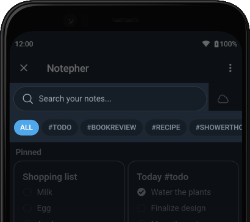
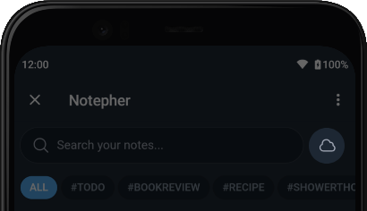
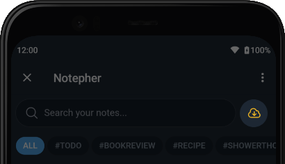
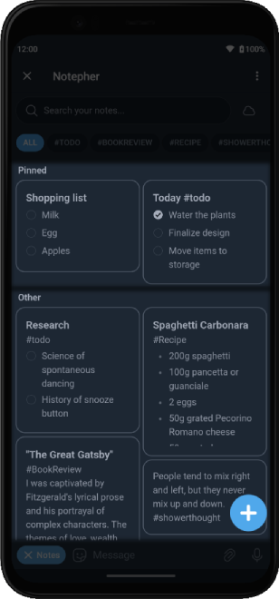
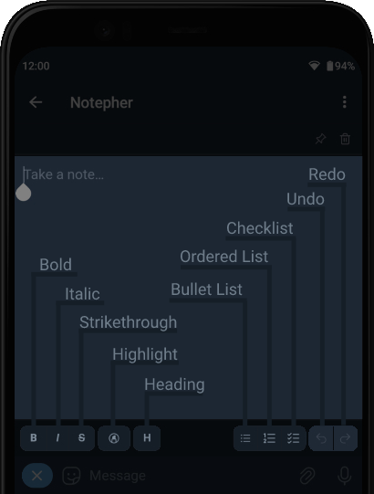
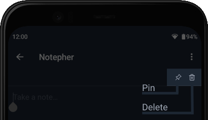
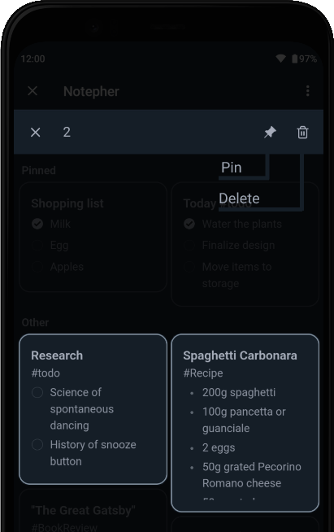

# Notepher User Guide

> **Note**
> Guide also available on [https://telegra.ph/Notepher-Bot](https://telegra.ph/Notepher-Bot-10-09).

## Prerequisites

Telegram client that supports Bot API version 6.9+ (required for Cloud Storage functionality).

## Compatibility

Compatibility confirmed in the following clients:
- Telegram Android **v10.1.3**
- Telegram Desktop (also known as Telegram Lite on macOS) **v4.10.3**
- Telegram macOS **v10.1.1**
- Telegram WebA **v10.0.11**
- Telegram WebK **v1.9.6**

Other clients may or may not work properly.

## Navigation

- [Search by Query and Filtering by Hashtags](#search-by-query-and-filtering-by-hashtags)
- [Synchronization](#synchronization)
- [List of Notes](#list-of-notes)
- [Create Note](#create-note)
- [Edit Note](#edit-note)
- [Note Actions](#note-actions)
- [Mass Actions with Notes](#mass-actions-with-notes)

### Search by Query and Filtering by Hashtags

At the top of the main screen, you'll find a search bar and a list of hashtags.

To search, enter your search query; search results will be displayed immediately after typing your query.

To filter notes by hashtag, select a hashtag from the list located below the search bar. Notes are automatically indexed, and hashtags are added to this list, sorted by the number of mentions in notes.

You can also combine search by search query and filtering by hashtag. The search will be performed only among notes that contain the selected hashtag.

[Jump to navigation](#navigation)

### Synchronization

On the main screen, to the right of the search bar, there is a synchronization indicator.

Synchronization occurs automatically during note changes and changes in connectivity status. In case of conflicts during synchronization, the last version is preserved, determined by the date of the latest changes.

The indicator can have three possible states:

- Data is up to date.
You can manually trigger synchronization by tap the indicator.

- New data is available in the cloud storage, synchronization is needed. 
To perform synchronization, tap the indicator.

- No internet connection, synchronization is unavailable.

**Tip!** If you want to reset local data and download all data from the cloud storage, hold the indicator and follow the instructions. **Warning**: unsynchronized changes will be lost.

[Jump to navigation](#navigation)

### List of Notes

On the main screen, there is a list of notes divided into two sections. The list of pinned notes is at the top, and the list of all other notes is located below this list.

[Jump to navigation](#navigation)

### Create Note

At the bottom right of the main screen, there is a button to create a new note.

[Jump to navigation](#navigation)

### Edit Note

To edit a note, tap on the note you want to edit in [the list of notes](#list-of-notes).

Depending on the platform, the editor will either open immediately, or you may need to enter editing mode using the 'Edit' button at the bottom of the screen.

At the bottom of the editor, there is a toolbar to format text, create lists, and undo/redo changes.

[Jump to navigation](#navigation)

### Note Actions

In [editing mode](#edit-note), at the top right, there are action buttons to pin/unpin or delete the note.

[Jump to navigation](#navigation)

### Mass Actions with Notes

To perform mass actions with notes (such as pin/unpin or delete), select the notes you want to take action on by holding them in [the list of notes](#list-of-notes).

[Jump to navigation](#navigation)